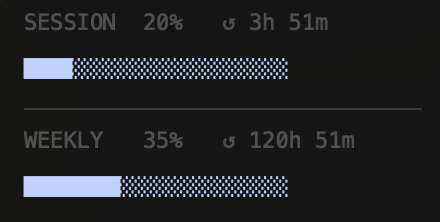

# Claude Usage Bar

A [SwiftBar](https://swiftbar.app) plugin that shows your **Claude.ai usage in the macOS menu bar** — session (5-hour window) and weekly limits, live.

No API keys. No tokens. Reads directly from your already-logged-in browser.



---

## What it shows

- **Menu bar**: current session usage % (color-coded: blue → yellow at 70% → red at 90%)
- **Dropdown**: session progress bar + time until reset
- **Dropdown**: weekly progress bar + time until reset

---

## Requirements

- macOS
- [SwiftBar](https://swiftbar.app) (free, open source)
- Python 3 (comes with macOS or install via `brew install python3`)
- Claude.ai open in one of: **Chrome, Brave, Edge, Chromium, or Comet**
- You must be logged in to claude.ai in that browser

---

## Install

**1. Install SwiftBar** if you haven't:
```
brew install --cask swiftbar
```

**2. Download the plugin:**
```bash
curl -o ~/your-swiftbar-plugins-folder/claude-usage.5m.py \
  https://raw.githubusercontent.com/aggel008/claude-usage-bar/main/claude-usage.5m.py

chmod +x ~/your-swiftbar-plugins-folder/claude-usage.5m.py
```

Or just clone this repo and copy the `.py` file to your SwiftBar plugins folder.

**3. Make it executable:**
```bash
chmod +x claude-usage.5m.py
```

**4. Open claude.ai** in Chrome, Brave, Edge, or Comet — and stay logged in.

**5. Click Refresh** in SwiftBar or wait up to 5 minutes.

That's it. No configuration needed.

---

## How it works

SwiftBar runs the script every 5 minutes. The script uses AppleScript to execute a `XMLHttpRequest` inside your open claude.ai browser tab — calling Anthropic's internal `/api/organizations/{id}/usage` endpoint with your existing session. The response is parsed and displayed.

Your credentials never leave your machine. The script does not store session tokens.

---

## Privacy

- Runs entirely on your Mac
- No external backend
- No telemetry or analytics
- No API keys, cookies, or session tokens are sent to the author or any third party
- All requests are made locally from your machine using your own logged-in Claude session

---

## Supported browsers

| Browser | Supported |
|---|---|
| Google Chrome | ✓ |
| Brave Browser | ✓ |
| Microsoft Edge | ✓ |
| Chromium | ✓ |
| Comet | ✓ |
| Safari | ✗ (no AppleScript JS execution) |
| Firefox | ✗ (no AppleScript JS execution) |
| Arc | not tested |

---

## Troubleshooting

**`✦` with no number** — claude.ai tab not found. Make sure it's open and you're logged in.

**`✦ !`** — unexpected error. Click the icon to see details.

**Wrong Python path** — the shebang line uses `/Library/Frameworks/Python.framework/Versions/3.11/bin/python3`. If your Python is elsewhere:
```bash
which python3
# then edit the first line of claude-usage.5m.py
```

**Permission denied** — run `chmod +x claude-usage.5m.py`

---

## License

MIT
